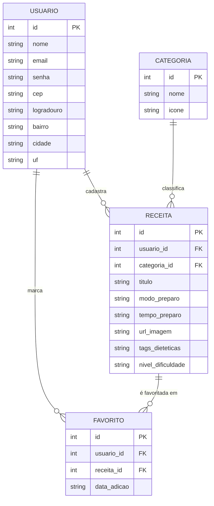

# 🏛️ Arquitetura e Especificação Técnica (Architecture.md)

Este documento especifica a arquitetura técnica, versionamento de tecnologias, contratos de APIs e a modelagem de dados do projeto **DevCook**.

---

## 📌 Especificação de Versões (Tecnologias & Dependências)

Para garantir reprodutibilidade e consistência no desenvolvimento (humano e por assistentes de IA), as tecnologias devem seguir estritamente as versões mapeadas abaixo:

| Tecnologia / Lib | Versão Exata | Função no Sistema |
| :--- | :--- | :--- |
| **HTML5** | W3C Standard | Estrutura semântica dos documentos |
| **CSS3** | W3C Standard | Customização de layout e temas |
| **Bootstrap** | `v5.3.3` | Grid responsivo, modais, formulários e cards |
| **jQuery** | `v3.7.1` | Manipulação do DOM e requisições AJAX |
| **Spoonacular API** | `v1 REST API` | Busca por ingredientes e dados nutricionais |
| **JSON Server** | `v0.17.4` | Backend fake / Mock REST local (`db.json`) |
| **ViaCEP API** | REST / JSON | Consulta e autopreenchimento de CEP |
| **Node.js** | `v20.x LTS` | Ambiente de execução para JSON Server |
| **npm** | `v10.x` | Gerenciador de pacotes do projeto |

---

## 🗄️ Modelo de Dados (Diagrama ER)

Diagrama de Entidade-Relacionamento do sistema para dados locais persididos via **JSON Server** ou **LocalStorage**.

### 📐 Diagrama de Relacionamento (Mermaid)



---

## 🔀 Fluxo de Integração de APIs

```
+-----------------------------------------------------------------------+
|                            FRONTEND (DevCook)                         |
|                 (Bootstrap 5.3 + jQuery 3.7.1 / JS ES6+)              |
+--------------------+----------------------------------+---------------+
                     |                                  |
    (Requisição AJAX)|                                  |(Requisição Fetch/AJAX)
                     v                                  v
+--------------------+--------+               +---------+---------------------+
|      JSON Server v0.17.4    |               |       Spoonacular API v1      |
|    (Receitas Autorais /     |               | (Receitas Globais / Busca por |
|      Usuários / Favs)       |               | Ingredientes / Nutrição)    |
+-----------------------------+               +-------------------------------+
```

### Estratégia de Consumo das Receitas:
1. **Catálogo Unificado:** O frontend executará chamadas assíncronas concorrentes (`Promise.all` ou múltiplos `$.ajax`) para consumir:
   - As receitas cadastradas pelos usuários locais via **JSON Server**.
   - As receitas globais fornecidas pela **Spoonacular API** (`https://api.spoonacular.com/recipes/findByIngredients`).
2. **Preenchimento de Endereço:** Utilização da **ViaCEP API** (`https://viacep.com.br/ws/{cep}/json/`) disparada no evento `blur` do campo de CEP.
3. **Módulo de Nutrição (Futuro):** Consumo do endpoint `/recipes/{id}/nutritionWidget.json` da Spoonacular API para cálculo automático de macronutrientes e calorias.
